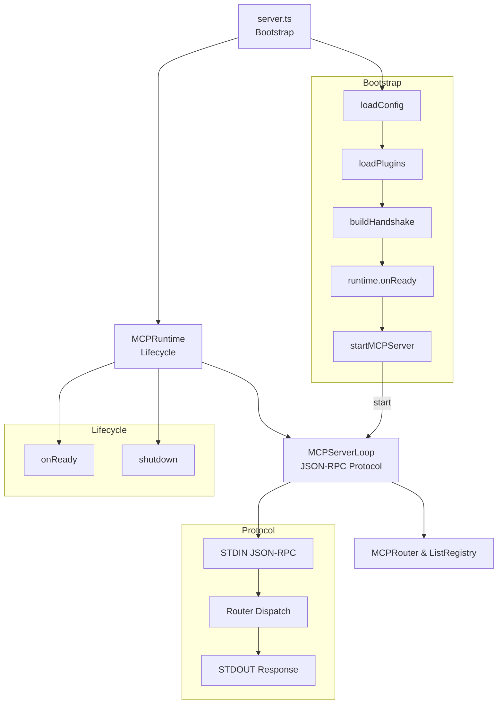

# mcp-server-general

A general-purpose MCP server designed for long-running, plugin-driven AI orchestration.

[](
https://github.com/daporun/mcp-server-general/actions/workflows/ci.yml
)

This server is fully compatible with the MCP JSON-RPC specification and works seamlessly with:

- **mcp-client-general** – a general-purpose MCP CLI & programmatic client  
  https://github.com/daporun/mcp-client-general

This repository implements a production-ready MCP server with:
- strict lifecycle management
- plugin-based extensibility
- protocol/lifecycle separation
- full test coverage

For plugin developers, see the [Plugin Author Guide](docs/plugin-author-guide.md).

## High-level Architecture

The MCP server is built from three strictly separated layers:



## Why this separation matters

**Protocol layer is stable**  
`MCPServerLoop` implements the MCP JSON-RPC contract and is validated against
[`mcp-client-general`](https://github.com/daporun/mcp-client-general).

**Lifecycle is explicit and testable**  
`MCPRuntime` only manages startup and shutdown phases.

**Plugins are isolated from transport details**  
Plugins never interact with STDIN / STDOUT directly.

This avoids the classic **“god-runtime” anti-pattern** and keeps each concern small and composable.

## Server Startup Flow

The full startup sequence executed by server.ts:

```text
loadConfig()
   ↓
loadPlugins()
   ├─ schema validation
   ├─ setup(ctx, config)
   └─ onInit(ctx)
   ↓
static registry setup (lists, core methods)
   ↓
buildHandshake()
   ↓
runtime.onReady()
   └─ plugin.onReady(ctx)
   ↓
startMCPServer()
   └─ long-running JSON-RPC loop
```

At the moment the MCP server loop starts, the system is fully initialized and in the READY state.

## Plugin Lifecycle

Plugins follow a strict, deterministic lifecycle:

schema → setup → onInit → onReady → (runtime) → onShutdown

### Lifecycle Hooks

#### `schema` (optional)
Declarative configuration validation using Zod.

#### `setup(ctx, config)` (optional)
Executed once after config validation.

**Allowed**
- Parsing
- Preparation
- Lightweight I/O

**Not allowed**
- Method registration

#### `onInit(ctx)` (optional)
Registration phase.

- Register MCP methods
- Register lists
- Wire runtime integrations

#### `onReady(ctx)` (optional)
Executed when the server is fully initialized.

- Warm-up logic
- Background tasks
- Health checks

**Fail-fast**  
If any plugin throws here, server startup aborts.

#### `onShutdown()` (optional)
Graceful teardown on `SIGINT` / `SIGTERM`.

- Close connections
- Flush buffers
- Stop background work

**Best-effort**  
Errors are logged but do not block other plugins.

## Runtime Guarantees

`MCPRuntime` enforces the following invariants:

- `onReady()` runs **at most once**
- `onShutdown()` runs **at most once**
- `onShutdown()` continues even if a plugin fails
- `onReady()` is **fail-fast**
- Lifecycle hooks are fully covered by **Vitest**


## Design Principles

Long-running server model
There is no onFinished() hook by design. MCP servers run until terminated.

Context is explicit
All lifecycle hooks that mutate runtime state receive MCPPluginContext.

Protocol ≠ Lifecycle
MCP JSON-RPC handling is intentionally decoupled from lifecycle logic.

## Getting Started

To interact with this server from the command line or from Node.js code, you can use:

- **mcp-client-general**  
  A general-purpose MCP client with CLI and TypeScript API  
  https://github.com/daporun/mcp-client-general

## Summary

This architecture provides:

- Predictable startup and shutdown
- Stable MCP protocol handling
- Clean plugin extensibility
- High testability
- Clear mental model for contributors

It is intentionally minimal, but designed to scale.